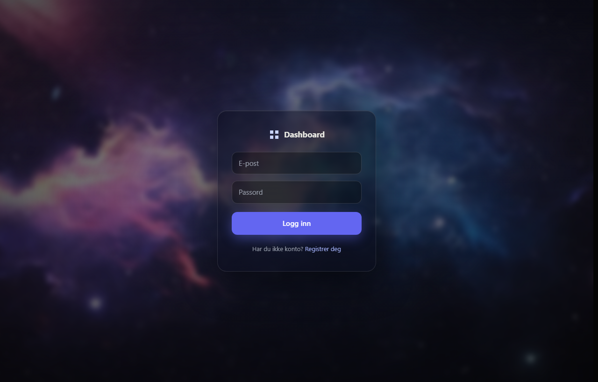
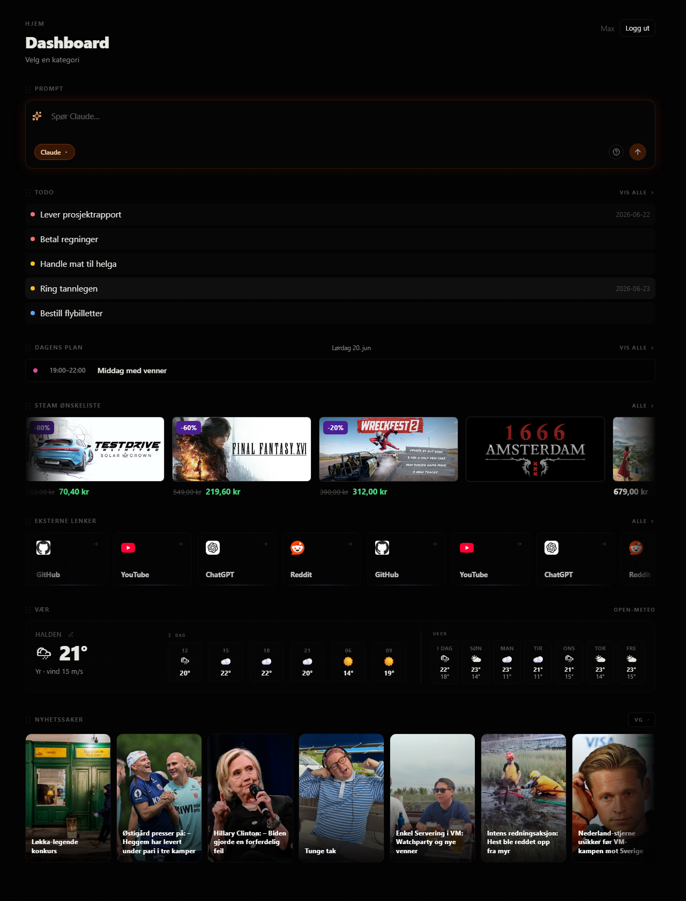
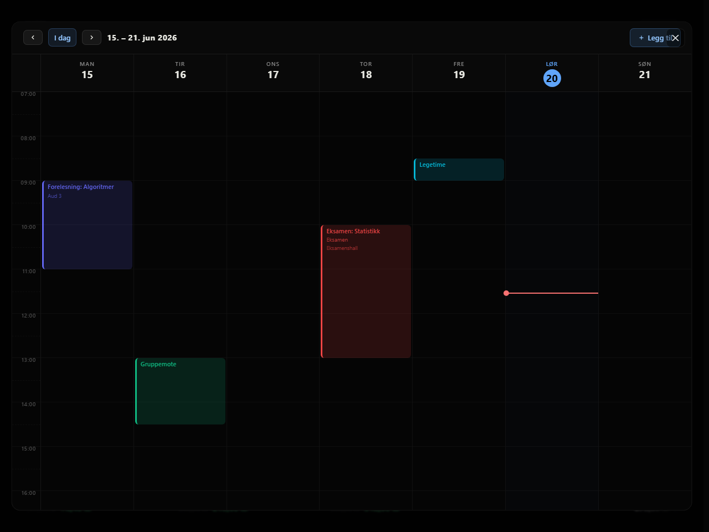
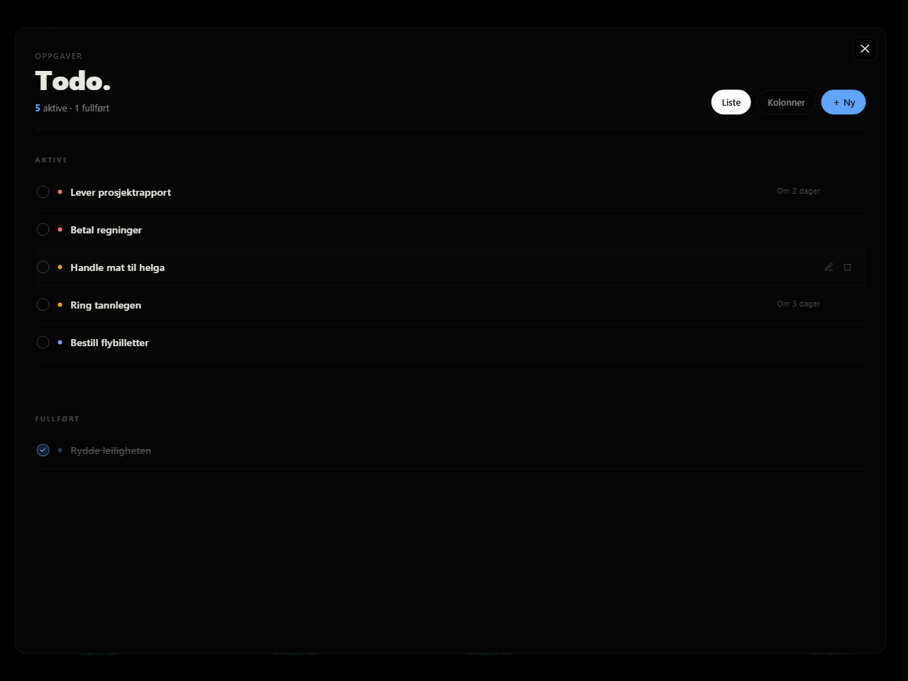
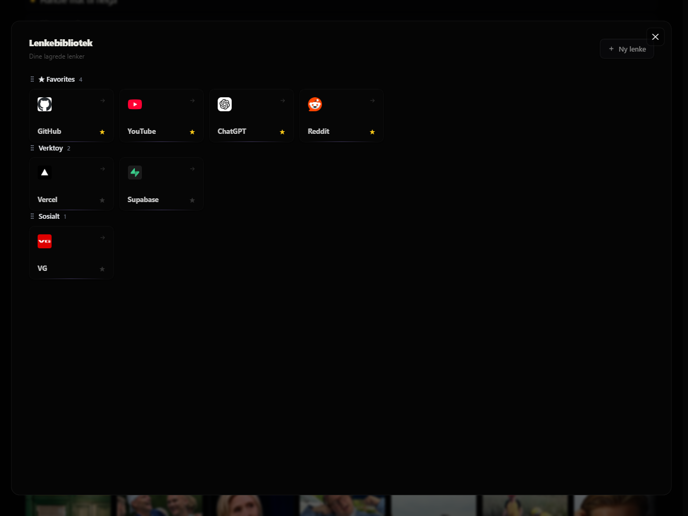
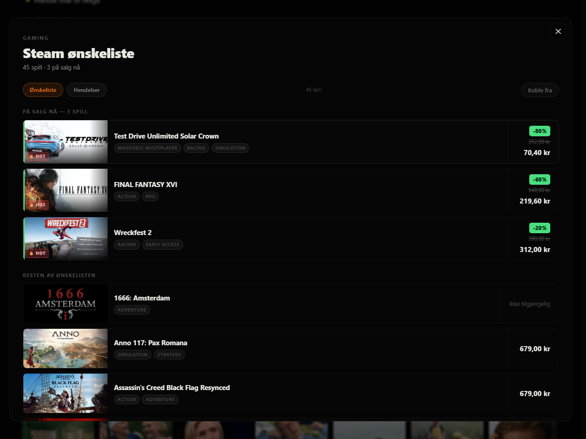
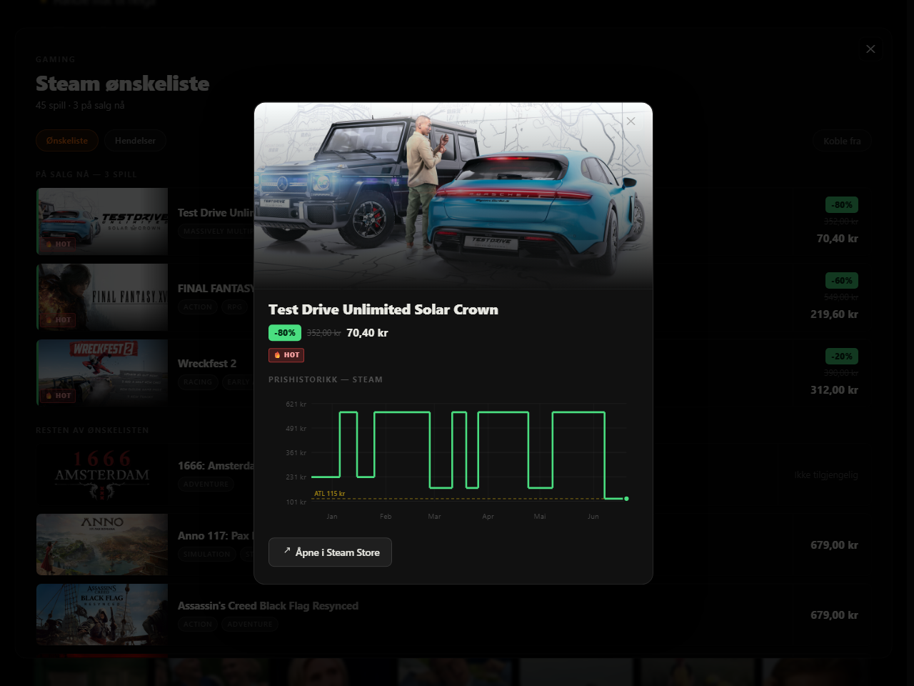

<div align="center">

# Dashboard

</div>

<p align="center"><b>A single-page personal dashboard for daily routines, study, and gaming.</b><br><i>One React app, fully serverless: static frontend on Vercel, data and auth on Supabase.</i></p>

<p align="center"><a href="https://dashboard-react-mauve-alpha.vercel.app"><b>Live site</b></a> &middot; login required</p>

<p align="center">
  
</p>

---

## What it does

Everything lives on **one customizable page**. Sections are drag-reorderable, and each area opens its full view in a pop-out overlay.

<table>
<tr>
<th align="center" width="33%">Home sections</th>
<th align="center" width="33%">Pop-out pages</th>
<th align="center" width="33%">Gaming</th>
</tr>
<tr>
<td valign="top">
<ul>
<li>Today's plan</li>
<li>Top todos</li>
<li>Steam wishlist carousel</li>
<li>External links</li>
<li>Weather</li>
<li>News feed</li>
<li>Quick prompt to AI</li>
</ul>
</td>
<td valign="top">
<ul>
<li>Plan (weekly calendar)</li>
<li>Todo (priorities, kanban)</li>
<li>Gaming (full wishlist)</li>
<li>Links library</li>
</ul>
<sub>Opened as overlays from the home page; no page reload.</sub>
</td>
<td valign="top">
<ul>
<li>Connect via Sign in through Steam (OpenID)</li>
<li>Per-user wishlist, sale tracking</li>
<li>All-time-low "hot" tags</li>
<li>Price history via the ITAD API</li>
</ul>
</td>
</tr>
</table>

## Screenshots

<p align="center"></p>
<p align="center"><sub><b>The home page.</b> One customizable, drag-reorderable page; each section's "Vis alle" opens the full view in a pop-out.</sub></p>

<table>
<tr>
<td width="50%"><br><sub><b>Plan.</b> Weekly calendar in a pop-out.</sub></td>
<td width="50%"><br><sub><b>Todo.</b> Priorities and deadlines; list or kanban view.</sub></td>
</tr>
<tr>
<td><br><sub><b>Links.</b> Favorites and categories, with favicons.</sub></td>
<td><br><sub><b>Gaming.</b> Steam wishlist with sale badges and all-time-low "hot" tags.</sub></td>
</tr>
<tr>
<td colspan="2" align="center"><br><sub><b>Price history.</b> ITAD chart and Steam link when you click a game.</sub></td>
</tr>
</table>

<sub>Screenshots use sample data; the live dashboard is yours to fill.</sub>

## Stack

- **Frontend:** React 18, TypeScript, Vite, Tailwind v4, React Router v6, TanStack Query, Radix UI primitives, dnd-kit, framer-motion.
- **Auth + data:** [Supabase](https://supabase.com) (hosted Postgres + Supabase Auth). Row-level security scopes every row per user. Schema lives in `supabase/migrations/`.
- **Serverless functions:** two Vercel Node functions in `api/` (`/api/wishlist`, `/api/news`) hold the third-party secrets (Steam, ITAD, RSS) the browser cannot.
- **Hosting:** [Vercel](https://vercel.com) serves the static build and runs the functions. No server to maintain.
- **UI language:** Norwegian (`nb-NO`).

## Layout

```
api/              Vercel serverless functions
  _lib/           shared: supabaseAdmin, cache, wishlist, news, steamOpenid
  wishlist.ts     per-user Steam wishlist (auth + cache)
  news.ts         VG / NRK / Aftenposten RSS
  steam/          OpenID login + callback
supabase/
  migrations/     SQL schema (documents, notes, cache, integrations)
src/
  api/            typed clients (Supabase queries + function fetches)
  hooks/          TanStack Query wrappers, one per domain
  context/        PageOverlay (pop-out state), Timer
  components/
    home/         the home sections (todo, plan, wishlist, links, weather, news)
    overlay/      PageOverlay (renders a full page in a pop-out)
    gaming/       shared GameModal (price-history chart)
    auth/         AuthCard (galaxy login shell)
    ui/           Modal + Toast primitives
  pages/          HomePage + the overlay pages (Plan, Todo, Gaming, Links) + Login/Signup
  lib/            pure helpers + design tokens (styles/globals.css)
screenshots/      captured with Playwright
```
