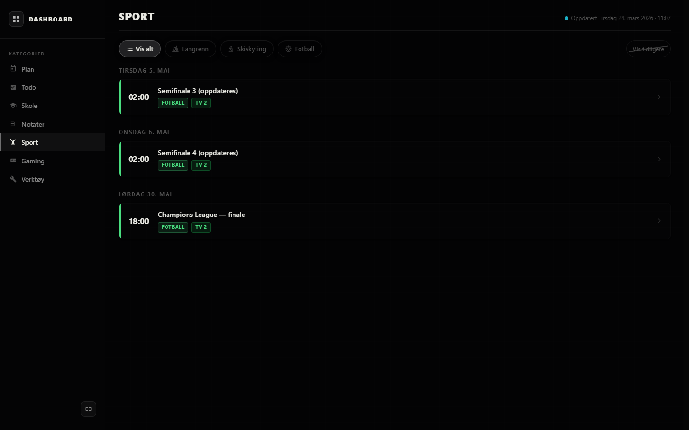
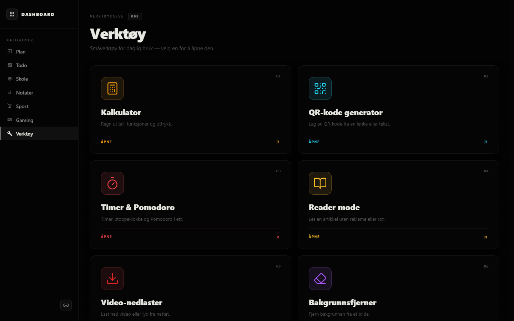
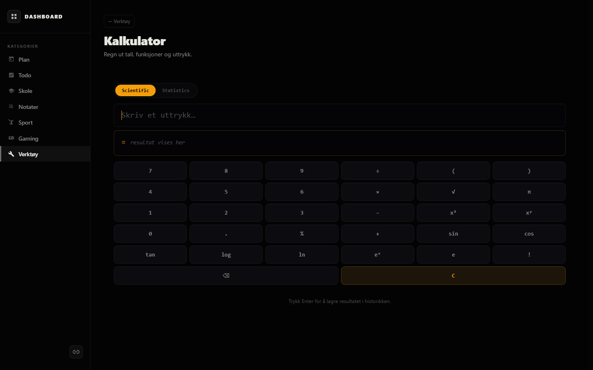
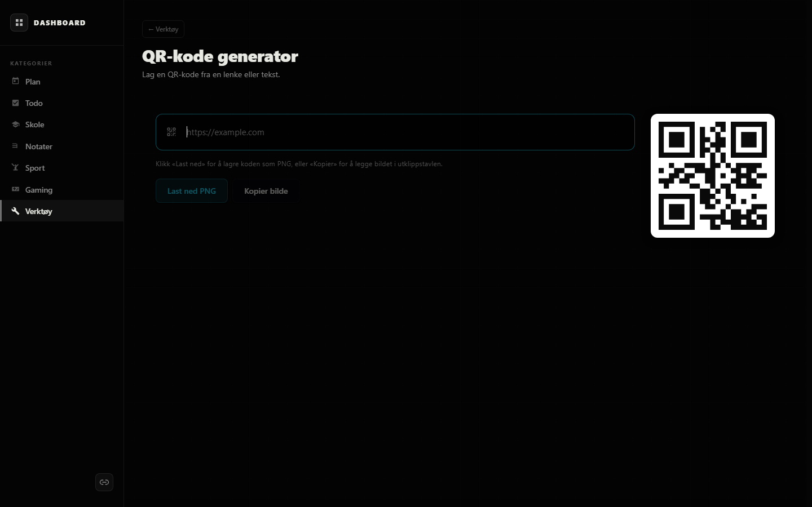
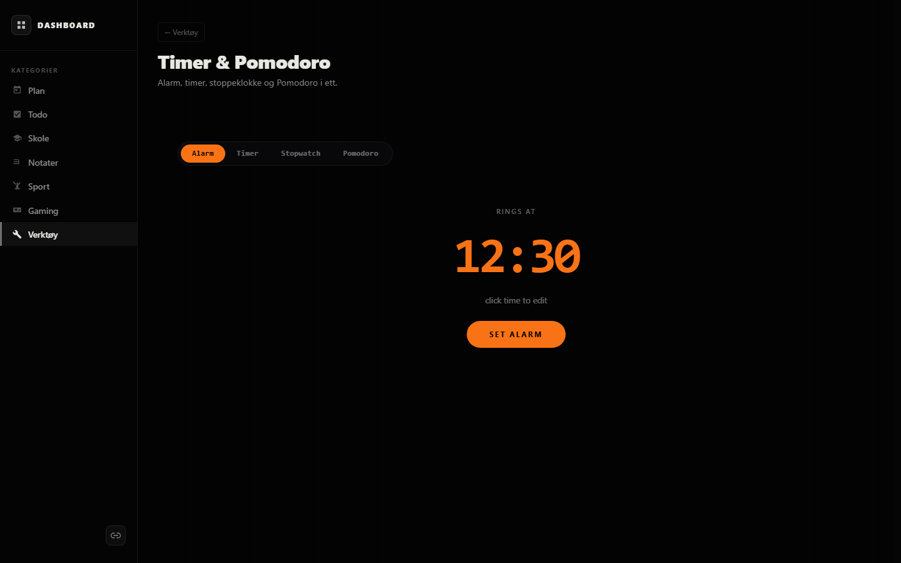
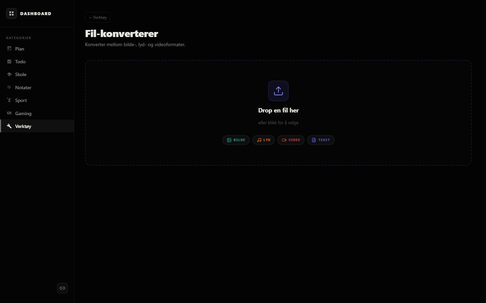

<div align="center">

# Dashboard

</div>

<p align="center"><b>A unified personal dashboard for daily routines, study, and quick tools.</b><br><i>One React SPA replacing a folder of standalone HTML pages.</i></p>

<table>
<tr>
<td width="33%" valign="top" align="center"><b>Schedule &amp; tasks.</b><br><sub>Weekly calendar with the class schedule, prioritized to-do list, and the latest school announcements.</sub></td>
<td width="34%" valign="top" align="center"><b>Personal hub.</b><br><sub>Markdown notes, sport TV schedule, Steam wishlist, and a saved-link library.</sub></td>
<td width="33%" valign="top" align="center"><b>Toolbox.</b><br><sub>Eight small utilities: calculator, QR, timer &amp; Pomodoro, PDF tools, reader mode, video downloader, background remover, file converter.</sub></td>
</tr>
</table>

<p align="center">
  
</p>

---

## Screenshots

<table>
<tr>
<td width="50%"><br><sub><b>Plan.</b> Weekly calendar with the class schedule.</sub></td>
<td width="50%"><br><sub><b>Todo.</b> Active and completed tasks, list or kanban view.</sub></td>
</tr>
<tr>
<td><br><sub><b>Sport.</b> TV schedule for football, cross-country, and biathlon.</sub></td>
<td><br><sub><b>Toolbox.</b> Card grid linking to all eight built-in utilities.</sub></td>
</tr>
<tr>
<td><br><sub><b>Calculator.</b> Scientific and statistics modes, with history.</sub></td>
<td><br><sub><b>QR.</b> Generate a code from any link or piece of text.</sub></td>
</tr>
<tr>
<td><br><sub><b>Timer &amp; Pomodoro.</b> Alarm, timer, stopwatch, and Pomodoro in one tool.</sub></td>
<td><br><sub><b>File converter.</b> Convert between image, audio, video, and text formats.</sub></td>
</tr>
</table>

## Stack

React 18, TypeScript, Vite, Tailwind v4, React Router v6, TanStack Query, Radix UI primitives, dnd-kit, react-markdown. Backend is a Python API on a separate host; nginx proxies `/api/*` in production and the Vite proxy forwards it in dev.

## Layout

```
src/
  api/          API client, per-endpoint modules, shared types
  hooks/        TanStack Query wrappers, one per domain
  components/
    layout/     AppShell, Sidebar, MobileDrawer, PageHeader
    ui/         Primitives: Button, Card, Modal, Input, Badge, Toast, ...
    patterns/   SortableList, HorizontalScroller, IconPicker, PdfViewer, ...
    widgets/    Composable home-page widgets
    calculator/ Calculator engine and panels
    timer/      Timer, stopwatch, Pomodoro
    links/      Link library popup and editors
    launcher/   Quick-prompt launcher
  pages/        One file per route
  styles/       globals.css with design tokens
  lib/          Utilities (cn, dates, ...)
screenshots/    Captured via capture.mjs (puppeteer-core + system Edge)
```
